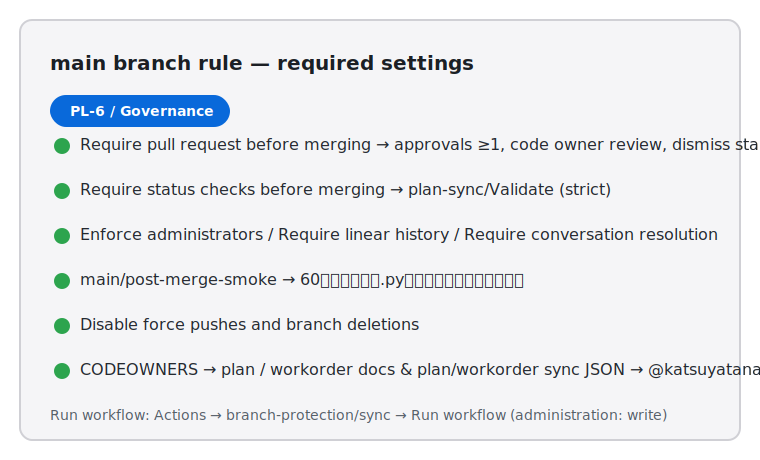

# PL-6 Branch Protection 運用ガイド

## 目的
- `main` ブランチへの直pushを禁止し、必ず Pull Request + Required Checks 経由でマージさせる。
- Required Check は `plan-sync/Validate` と `wo:ready/Validate` の 2 本を強制し、Plan/Workorder いずれの変更も自動ガードを通過しないとマージできないようにする。
- plan / workorder 系の変更については `CODEOWNERS` でレビュー推奨者を通知しつつ、必須レビューは課さず Required Check でガードする。
- Merge 後は `main/post-merge-smoke` が 60 秒監視を実施する前提を明文化し、ガードの抜け漏れを防ぐ。
- 自動生成ブランチ `docs-sync/workorder` は GitHub Actions のみ force-with-lease push を許可し、人手での直接 push を抑止する。
- `wo:ready/Validate` の Required 化はリポジトリ変数 `WORKORDER_ENFORCE_READY_LABEL`（既定値 `0`）で段階的に有効化できる。開発段階は `0`（警告のみ）、本番稼働時に `1` へ切り替えてブロック運用に移行する。

## 事前条件
- `.github/CODEOWNERS` が `docs/agile/plan.md` / `docs/agile/workorder.md` / `doc_sync_plan.json` / `workorder_sync_plan.json` / `docs/agile/runbooks/plan-*.md` / `docs/agile/runbooks/workorder-*.md` を `@katsuyatanaka1994` に割り当て済み。
- GitHub Actions → General → Workflow permissions が **Read and write** に設定されている。
- リポジトリシークレット `BRANCH_PROTECTION_TOKEN` が repo administration:write を含む PAT または GitHub App トークンで登録されている。
- リポジトリ管理者が Branch protection と CODEOWNERS を編集できる権限を保有している。

## 設定・更新手順
1. GitHub → Settings → Branches → **Branch protection rules** で `main` を編集。
2. 以下を有効化：
   - **Require a pull request before merging**（Approvals 必須なし、Code Owner レビューは OFF）。
   - **Require status checks to pass before merging** → `plan-sync/Validate` と `wo:ready/Validate` を選択し **Require branches to be up to date** をON。
   - **Do not allow bypassing the above settings**（Enforce for administrators）。
   - **Require linear history** / **Require conversation resolution before merging**。
   - **Do not allow force pushes / Do not allow deletions**。
3. 「Who can push to matching branches」は空のまま（＝全員PR経由）。必要に応じて GitHub App のみ許可する場合は `branch-protection/sync` ワークフローの `restrictions` を編集する。
4. 保存後、対象PRで Required Check が `plan-sync/Validate` と `wo:ready/Validate` の 2 本になり、両方が緑でないとマージできないことを確認する。
5. GitHub → Settings → Branches で `docs-sync/workorder` ブランチに対し、**Restrict who can push to matching branches** を ON にして `GitHub Actions` アプリのみを許可し、**Allow force pushes** を ON にする（force-with-lease 更新のため）。
6. `wo:ready` ラベルの強制を開始するタイミングで、リポジトリ変数 `WORKORDER_ENFORCE_READY_LABEL=1` を設定する。初期導入時は `0` のまま警告運用で構わない。

## CLI での確認（`gh`）
```bash
# Required Checks の確認（plan-sync/Validate と wo:ready/Validate が Required）
gh api repos/:owner/:repo/branches/main/protection | jq '.required_status_checks.contexts'

# Pull Request レビュー設定の確認
gh api repos/:owner/:repo/branches/main/protection \
  | jq '.required_pull_request_reviews | {approvals: .required_approving_review_count, code_owner: .require_code_owner_reviews}'

# docs-sync/workorder ブランチの push 制限確認
gh api repos/:owner/:repo/branches/docs-sync/workorder/protection \
  | jq '.restrictions.apps'

# post-merge smoke の有効化確認
gh workflow view main-post-merge-smoke --json name,state | jq '{name, state}'
```
- 期待結果：`["plan-sync/Validate","wo:ready/Validate"]` が返り、`code_owner: false` / `approvals: 0`。`main/post-merge-smoke` は `active`。
- `docs-sync/workorder` は `[{"slug":"github-actions","name":"GitHub Actions"}]` が返り、他ユーザー/チームは空配列。
- `WORKORDER_ENFORCE_READY_LABEL` は `gh variable get WORKORDER_ENFORCE_READY_LABEL` で確認し、`1` になっていれば強制モード。

## ワークフローでの同期
- `.github/workflows/branch-protection-sync.yml` を手動実行（Actions → branch-protection/sync → **Run workflow**）。最初のステップで `BRANCH_PROTECTION_TOKEN` 未設定が検知されると即時エラーになる。
- 成功すると Actions ログに `Updated branch protection for <repo>@main` と Required Checks が出力される。
- GitHub UI の設定と CLI の出力が一致するかをダブルチェック。
- Settings → Branches → Code owners review は OFF（通知のみ）であることを確認し、必要に応じて CODEOWNERS へ通知対象を追加する。

## スクリーンショット
- 運用ハンドブック共有用：



## トラブルシュート
- `403 Resource not accessible by integration` → `BRANCH_PROTECTION_TOKEN` のスコープ不足。repo → Administration: write を付与した PAT / GitHub App トークンを再発行し、シークレットを更新する。
- Required Check がリストに表示されない → `plan-sync/Validate` / `wo:ready/Validate` を main で一度成功させ、チェック名を確定させる。いずれかが一度も成功していないと選択肢に出ない。
- `docs-sync/workorder` へ push できない → GitHub Actions 以外のアカウントで push しようとしていないか確認。運用上、人手での push は禁止。緊急で必要なら Branch protection を一時解除した上で、作業後に `branch-protection/sync` で設定を戻す。
- `wo:ready/Validate` が黄のままブロックされない → `WORKORDER_ENFORCE_READY_LABEL` が `0` のままか確認。ブロックを有効化したい場合は `1` に切り替え、ラベルを付けた状態で `wo:ready/Validate` を再実行する。
- Code owner レビューで該当ユーザーに通知されない → `CODEOWNERS` のパス表記が `/` から始まっているか、GitHub側で Code Owners 機能が有効か確認する。

## 実測証跡（PL-6）
- [PL-6 Branch Protection Evidence — 2025-10-31](evidence/PL-6-branch-protection-20251031.md)
