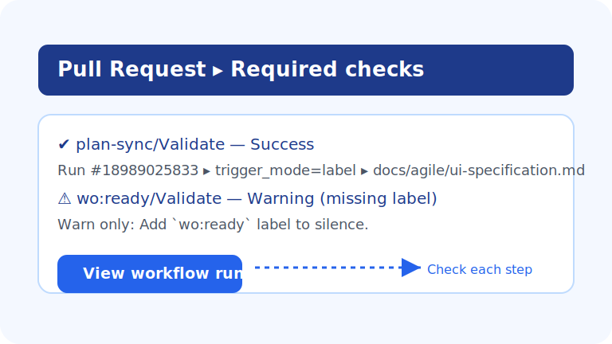

# plan-sync ランブック（PL-10 オンボーディング）

> plan-sync を 1 分で正常運転させ、3 分で赤枠を復旧できることをゴールとしたランブックです。トリガー方法・ガード失敗時の対処・よくある FAQ をひとつにまとめ、初見メンバーでも迷わず運用できるように構成しています。

## 1 分ランブック（成功ルート）
- **対象 PR / ブランチを決める**: UI 仕様 (`docs/agile/ui-specification.md`) など AUTO 対象差分が揃っていることを確認。
- **plan-sync を起動する**: PR で `plan:sync` ラベルを付与、`/plan sync` コメント、もしくは Actions → `plan-sync/Validate` → Run workflow から手動実行。
- **ガード結果をチェック**: `plan-sync/Validate` / `wo:ready/Validate` の両方が `Success` になり、Run summary で `plan preflight → apply → validate → pr` が順番に緑で完走していることを確認。
- **自動 Draft PR を確認**: `docs-sync/plan` ブランチの Draft PR が生成され、本文に Trigger / Source PR / plan_snapshot_id が記録されていれば完了。

## 3 分ランブック（赤→緑の復旧）
### ケース 1: ガード（行数/ファイル/禁止パス）が赤
1. Actions Run の `Artifacts` から `plan-limits-report.zip` をダウンロードし、`tmp/plan_limits_report.json` の `limits` セクションでヒット理由を確認。
2. 変更を分割する、許可パスへ移動するなどして再度 `plan:sync` を実行。
3. なおらない場合はリポジトリ変数 (`PLAN_SYNC_ALLOWED_PATHS` 等) を確認し、調整が必要ならオーナーに escalate。

### ケース 2: MANUAL 節が変わり `manual-accept` が必要
1. 失敗ログの `manual diff detected` を確認し、ローカルで `python3 scripts/validate-agile-docs --allow-manual-diff --manual-diff-report tmp/manual.diff` を実行。
2. `tmp/manual.diff` をレビューして MANUAL 節の差分が意図通りか確認。
3. 問題なければメンテナーに `manual-accept` を依頼し、許可後に `plan:sync` を再実行。

### ケース 3: 自動発火が動かない
1. PR のコメントに `<!-- plan-sync:auto -->` が存在するか、`plan-sync/Validate` の Run が作成されているかを確認。
2. Run が無い場合は `PLAN_AUTO=1` か、対象がフォーク／`[skip plan]` で弾かれていないかをチェック。
3. 急ぎの場合は `plan:sync` ラベルまたは `/plan sync` を手動で付与して直列キューに載せる。

## 運用チェックリスト
- **事前**: `docs/agile/ui-specification.md` の差分を確認、不要な生成物差分が無いかレビュー。
- **実行中**: Actions Run に `trigger_mode`（label/auto/dispatch）が期待通り出ているか、ガードコメントが付いていないかを確認。
- **完了後**: Draft PR の本文に最新の `plan_snapshot_id` と `targets.modify` が揃っていること、Required Checks (`plan-sync/Validate` / `wo:ready/Validate`) が両方緑であること、post-merge 監視 (`main/post-merge-smoke`) が緑のままであることを確認。
- （開発段階で `wo:ready/Validate` のブロックを外したい場合は、リポジトリ変数 `WORKORDER_ENFORCE_READY_LABEL=0` を維持する。ブロックを戻すときは `1` に切替後、`wo:ready` ラベルを付けて再実行。）
- 自動生成 Draft PR（`docs-sync/workorder` 等）をブロック対象外にしたい場合は `WORKORDER_READY_AUTO_BRANCHES` にブランチ名を追加しておくと、同一リポジトリ内であればラベル無しでもチェックが緑になる。
- **週次**: `reports/plan-sync-report.md` のダイジェストをチェックし、ガードヒットや失敗理由が増えていないかをモニタリング。

## FAQ 10 選（よくある問いと対処）
- **Q. `auto trigger disabled (PLAN_AUTO!=1)` で起動しません。**
  - **A.** リポジトリ変数 `PLAN_AUTO` が `1` か確認。OFF のままでも手動トリガー（ラベル/コメント/UI）は利用できます。
- **Q. `auto trigger disallowed for forks` と出て止まります。**
  - **A.** pull_request_target を安全に保つためフォーク PR は自動起動不可です。元 PR で `plan:sync` ラベルを付けてください。
- **Q. `plan branch self-trigger` でスキップされました。**
  - **A.** 固定ブランチ `docs-sync/plan` からの PR はループ防止のため除外しています。元 PR に戻って再トリガーしてください。
- **Q. Guard コメントで `allowed paths` に入っていないと言われます。**
  - **A.** 差分が `PLAN_SYNC_ALLOWED_PATHS` から外れているか確認。必要な場合は差分を docs/agile/** など許可パスへ移動。
- **Q. `max_changed_lines` / `max_changed_files` を超えて停止しました。**
  - **A.** 変更をタスク単位で分割し再実行。どうしても超える場合は上限緩和を検討する前にレビューへ相談。
- **Q. `automation PR ceiling reached` と出て PR が作られません。**
  - **A.** 開いている自動 Draft PR (`docs-sync/plan`) をクローズするかマージし、枠を空けてから再実行。
- **Q. Draft PR ができても Required Check が赤です。**
  - **A.** 元 PR の `plan-sync/Validate` チェック詳細を開き、失敗ステップのログを確認。多くは guard か diff 検証で止まっています。
- **Q. `tmp/plan_limits_report.json` が無いと言われます。**
  - **A.** `plan_cli.py` が途中で落ちた可能性があります。CLI ログに Python 例外が無いか確認し、必要ならローカルで `python3 scripts/plan_cli.py apply` を再現。
- **Q. `manual diff detected` で止まった後の進め方は？**
  - **A.** MANUAL 節の差分レビューを共有し、`manual-accept` ラベルまたは許可コメントをもらってから再実行。
- **Q. `wo:ready/Validate` が赤 (Required check) のままです。**
  - **A.** Workorder 側の同期・検証が未完了です。`python3 -m scripts.workorder_cli validate` で `docs/agile/workorder.md` を更新し、PR に `wo:ready` ラベルが付いているかを確認した上で再走させてください。
- **Q. `wo:ready` ラベルなしでも緑になっています。ブロックされないのはなぜ？**
  - **A.** `WORKORDER_ENFORCE_READY_LABEL=0`（既定）のまま運用している場合は警告止まりです。本番稼働でブロックしたいときはリポジトリ変数を `1` に設定してください。自動生成 Draft PR を緑のまま許可したい場合は `WORKORDER_READY_AUTO_BRANCHES` に対象ブランチ名を登録します（同一リポジトリに限定されます）。

## 参考リンク
- ワークフロー: `.github/workflows/plan-sync.yml`
- ガード仕様: `scripts/plan_cli.py`, `tmp/plan_limits_report.json`
- スモーク手順: `docs/agile/runbooks/plan-sync-smoke.md`
- Branch 保護: `docs/agile/runbooks/plan-branch-protection.md`
- 週次レポート: `reports/plan-sync-report.md`

## 更新手順メモ
- ランブック更新時は `katsuya-plan/CI_IMPACT.md` に影響範囲を追記し、`docs/agile/runbooks/README.md` へリンクを追加する。
- スクショ差し替え時は `docs/assets/plan-sync-*.svg` を更新し、古いファイルが未参照になったら削除する。
