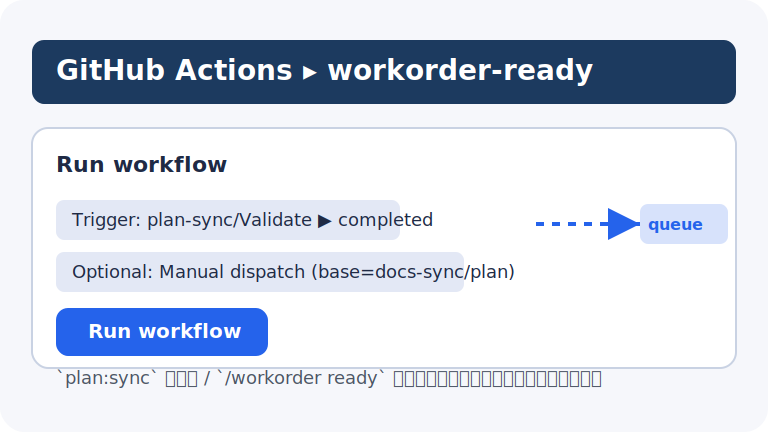
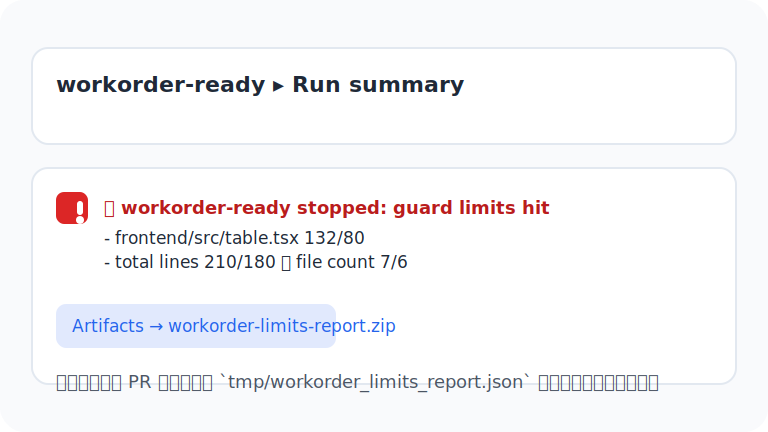

# workorder-ready ランブック（WO-10 オンボーディング）

> workorder を 1 分で安全に走らせ、3 分以内に赤枠を緑へ戻すことをゴールとしたランブックです。Implementation Draft PR（`docs-sync/workorder`）の生成／停止手順と、失敗時の対応フロー・FAQ をまとめています。

## 1 分ランブック（成功ルート）
- **対象 PR を確認する**: `plan:sync` ラベルが付き、`wo:ready` ラベルも付与済み（または `WORKORDER_ENFORCE_READY_LABEL=0` で非ブロック）であることを確認。Required Check `wo:ready/Validate` が緑なら自動実装に進めます。
- **workorder-ready を起動する**: plan-sync の完了を待つか、Actions ▸ `workorder-ready` ▸ `Run workflow` から手動実行。必要に応じて `plan_branch` / `base` 入力を `docs-sync/plan` 以外に切り替えます。
- **ガード結果を確認する**: Run summary に `workorder_cli ready` → guard → PR 作成の順で緑が並んでいることを確認。Artifact `workorder-limits-report.zip` が生成されていれば、ガード統計も保存済みです。
- **Draft PR を点検する**: `docs-sync/workorder` の Draft PR が更新され、本文に Trigger / plan_snapshot_id / Tasks が記録されているか確認。Required Checks が緑のままなら完了です。

## 3 分ランブック（赤→緑の復旧）
### ケース 1: ガード（行数/禁止パス）が赤
1. Run summary の赤行を開き、PR コメントに出力された理由（limit_exceeded / blocked_paths など）を確認。
2. Artifacts ▸ `workorder-limits-report.zip` → `workorder_limits_report.json` をダウンロードし、`file_over_limit` / `blocked_files` を特定。
3. 差分を分割する、許可パスへ移す、`tasks[i].acceptance.max_changed_lines` を下回るよう調整した上で `plan:sync` → `workorder-ready` を再実行。

### ケース 2: `wo:ready` ラベル不足（Required Check 赤）
1. `wo:ready/Validate` の Run summary を確認し、`Result: failure (missing 'wo:ready' label; enforcement enabled)` が出ているかチェック。
2. ソース PR に `wo:ready` ラベルを付ける（自動 Draft PR 用ブランチなら `WORKORDER_READY_AUTO_BRANCHES` に登録されているか確認）。
3. もう一度 `wo:ready/Validate` → `workorder-ready` を実行し、チェックが緑になることを確認。

### ケース 3: 連続失敗で `workorder:suspended` が付与された
1. ソース PR のラベルに `workorder:suspended` が付いていないか確認。コメントに `⚠️ workorder-ready を停止しました...` が残っているはずです。
2. コメント内の `last_failure` / `reason` をもとに原因を解消し、`workorder-ready` の guard が通る状態まで差分を調整。
3. ラベルを手動で外した上で `workorder-ready` を再実行。Run 成功時に failure ledger が自動で削除されることを確認。

### ケース 4: `open docs-sync/workorder PRs` が上限に達した
1. Run summary に `🛑 workorder-ready stopped: open docs-sync/workorder PRs (N/L).` が出ているか確認。
2. リストされている Draft PR を確認し、不要なものをクローズ・マージして枠を空ける。必要なら差分を手動でマージ後に PR を閉じる。
3. 枠を確保したら `workorder-ready` を再実行し、新しい Draft PR が作成されることを確認。

## 運用チェックリスト
- **事前**: `docs/agile/workorder.md` の MANUAL 節が最新であるか、plan 側の `tasks` / `outputs` に変化がないか確認。
- **実行中**: Run summary に `Skipping workorder-ready: ...` が出た場合は理由を読み、必要なラベル／トグル設定を直す。
- **完了後**: Draft PR の本文に `plan_snapshot_id` と `Tasks` が記録されていること、`wo:ready/Validate` / `plan-sync/Validate` が緑であることを確認。
- **週次**: `reports/workorder-weekly.md` をチェックし、No-Op 率や guard ヒット件数が異常に増えていないかをモニタリング。
- **設定変更時**: `WORKORDER_ALLOWED_PATHS` や上限トグルを調整した場合は、同じ変更を CI 変数・Runbook・CI_IMPACT に反映する。
- **監査ログ**: `docs/agile/workorder-audit.log`（JSON Lines）に最新実行が追記されていること、Actions アーティファクト `workorder-audit-entry` が run ID・guard 結果を記録していることを確認。

## FAQ 10 選（よくある問いと対処）
- **Q. `Skipping workorder-ready: source PR missing plan:sync label` と出て止まります。**
  - **A.** ソース PR に `plan:sync` ラベルが必須です。ラベルを付けて `plan-sync/Validate` を通し、再度 `workorder-ready` を待ちます。
- **Q. `Skipping workorder-ready: docs-sync/workorder self-trigger` と表示され実行されません。**
  - **A.** Implementation Draft PR からの自己発火は遮断しています。元の plan PR に戻り、新しい変更を push してください。
- **Q. `Skipping workorder-ready: workorder automation suspended` と表示されました。**
  - **A.** `workorder:suspended` ラベルが付いている状態です。失敗コメントの原因を解消し、ラベルを外してから再実行してください。
- **Q. `workorder-ready stopped: guard limits hit` が出ています。**
  - **A.** 行数・ファイル数などの上限を超えています。Artifact の `workorder_limits_report.json` で超過対象を確認し、差分を分割または縮小してください。
- **Q. `workorder-ready stopped: disallowed paths detected` と出ました。**
  - **A.** `WORKORDER_ALLOWED_PATHS` 外や `workorder.blocked_paths` に触れています。差分を許可パスへ移すか、手動作業へ切り替えてください。
- **Q. Draft PR が No-Op で更新されません。**
  - **A.** `docs/agile/workorder.md` / `workorder_sync_plan.json` に変更が無い場合は No-Op が正しい挙動です。plan 側に差分があるかを確認し、必要な場合は `python -m scripts.workorder_cli ready` をローカルで実行して差分を再生成します。
- **Q. `workorder_cli validate` が `plan_snapshot_id が plan.md と一致しません` で失敗します。**
  - **A.** `plan.md` 側の `plan_snapshot_id` が更新されています。`python -m scripts.workorder_cli ready` を実行して AUTO 節を再同期してください。
- **Q. `Tasks に Plan のタスクが不足しています` というエラーが出ます。**
  - **A.** plan 側でタスク ID が追加されたが workorder に反映されていません。`ready` サブコマンドで同期し、`wo:ready/Validate` を再実行してください。
- **Q. `Missing 'wo:ready' label (non-blocking)` としてスキップされました。**
  - **A.** `WORKORDER_ENFORCE_READY_LABEL=0` のため警告のみです。Required として扱いたい場合はリポジトリ変数を `1` に切り替えて再実行します。
- **Q. `gh pr create` が失敗し Draft PR が作れません。**
  - **A.** GitHub App トークンが取得できなかった可能性があります。`secrets.GH_APP_ID` / `GH_APP_PRIVATE_KEY` が有効か、`actions/create-github-app-token` のログで権限エラーが出ていないか確認してください。

## 参考リンク
- ワークフロー: `.github/workflows/workorder-ready.yml`, `.github/workflows/workorder-validate.yml`
- CLI: `scripts/workorder_cli.py`, `scripts/workorder_guard.py`
- ガード設定: `workorder_sync_plan.json`, `docs/agile/workorder.md` AUTO 節
- メトリクス: `reports/workorder-weekly.md`
- エスカレーション設定: `vars.WORKORDER_FAIL_THRESHOLD`, `vars.WORKORDER_ESCALATION_LABEL`
- 監査ログ: `docs/agile/workorder-audit.log`, Actions アーティファクト `workorder-audit-entry`

## 更新手順メモ
- ランブックを更新したら `katsuya-plan/CI_IMPACT.md` に影響範囲を追記し、Runbook ハブ（`docs/agile/runbooks/README.md`）へリンクを追加する。
- スクショ・図版を差し替える際は `docs/assets/workorder-*.svg` を更新し、未参照の旧ファイルがあれば削除する。
- 運用ルールを変更した場合は `plan-sync-smoke` など関連 Runbook や PBI（`katsuya-plan/workorder-PBI.md`）の実績メモも合わせて更新する。
